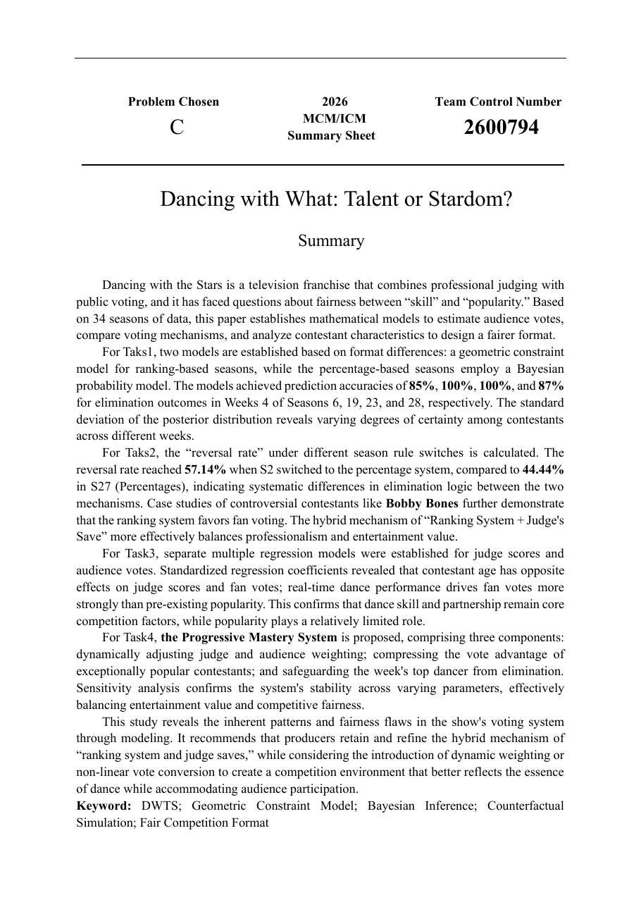

# MCM 2026 Problem C

本仓库展示 2026 Mathematical Contest in Modeling Problem C 的团队论文与清洗数据。研究对象为《Dancing with the Stars》34 季评分和淘汰记录，目标是分析评委评分与观众投票之间的关系，并比较不同淘汰机制。

## 方法

- 在排名制中使用几何约束与 Monte Carlo 拒绝采样，恢复满足淘汰结果的观众排名空间。
- 在百分比制中使用 Dirichlet Bayesian/MCMC，对观众投票比例及不确定性进行反演。
- 使用反事实模拟和 Flip Rate 比较不同赛制对淘汰结果的影响。
- 通过分组回归、Bootstrap 与噪声扰动检验结论的稳定性。

## 结果摘要

- 淘汰预测平均准确率超过 93%。
- 第二季与第二十七季的机制翻转率分别为 57.14% 和 44.44%。
- 提出的 Progressive Mastery System 使能力导向指标提高 1.76%。

## 文件

- `paper/Dancing_with_What_Talent_or_Stardom.pdf`：最终英文论文
- `data/cleaned_dwts_data.xlsx`：团队清洗后的建模数据

## 说明

竞赛论文采用控制号匿名提交。仓库不包含历届获奖论文、竞赛参考资料或其他第三方材料。
